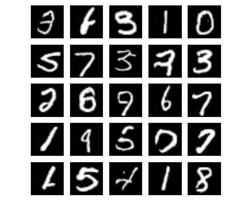

# Jittor：图像生成之LSGAN

生成对抗网络（GAN, Generative Adversarial Networks ）是一种深度学习模型，是近年来复杂分布上无监督学习最具前景的方法之一。GAN模型由生成器（Generator）和判别器（Discriminator）两个部分组成。在训练过程中，生成器的目标就是尽量生成真实的图片去欺骗判别器。而判别器的目标就是尽量把生成器生成的图片和真实的图片分别开来。这样，生成器和判别器构成了一个动态的“博弈过程”。许多相关的研究工作表明GAN能够产生效果非常真实的生成效果。

本教程使用Jittor框架实现了一种经典GAN模型LSGAN [1]。LSGAN将GAN的目标函数由交叉熵损失替换成最小二乘损失，以此拒绝了标准GAN生成的图片质量不高以及训练过程不稳定这两个缺陷。本教程通过LSGAN的实现介绍了Jittor数据加载、模型定义、模型训练的使用方法。

LSGAN论文：https://arxiv.org/abs/1611.04076


## 1.数据集准备

本教程使用两种数据集进行LSGAN的训练，分别是Jittor自带的数据集MNIST，和用户构建的数据集CelebA。

使用MNIST训练无需自行下载数据集。

如果要使用CelebA数据集进行训练，可以通过以下方法构建CelebA数据集。

1. 下载CelebA数据集，CelebA 数据集下载地址： <http://mmlab.ie.cuhk.edu.hk/projects/CelebA.html>

2. 将下载的训练数据和验证数据分别存储在`./data/celebA_train/imgs/`和`./data/celebA_eval/imgs/`中

   最终数据集的文件组织如下。

   ```
   根目录
   |----data
        |----celebA_train
        |    |----imgs
        |----celebA_eval
        |    |----imgs
   ```


## 2.快速开始

运行以下命令即可开始训练，每个epoch会使用生成器通过固定向量生成图片，将图片显示并存储在`./results_img/`中。

```cmd
python3.7 train.py
```


## 3.结果及测试

### 3.1.生成结果

本教程分别使用MNIST和CelebA数据集分别进行了`20`个和`50`个epoch的训练。训练完成后各随机采样了25张图像，结果如下。




### 3.2.速度对比

本教程使用Jittor与主流的深度学习框架PyTorch进行了训练速度的对比，下表为PyTorch(是/否打开benchmark)及Jittor在两种数据集上进行`1`次训练迭带的平均使用时间。得益于Jittor的异步接口及特有的元算子融合技术，其训练速度（平均每秒训练iter数）比PyTorch快了约`50%~60%`。

|                              | MNIST        | CelebA       |
| ---------------------------- | ------------ | :----------- |
| pytorch                      | 0.4584 s     | 0.4929 s     |
| pytorch-benchmark            | 0.4356 s     | 0.4698 s     |
| Jittor                       | **0.2871 s** | **0.3108 s** |
| speed up (pytorch)           | 59.7%        | 58.6%        |
| speed up (pytorch-benchmark) | 51.7%        | 51.2%        |


## 4.参考文献

[1] Mao, Xudong, et al. "Least squares generative adversarial networks." *Proceedings of the IEEE International Conference on Computer Vision*. 2017.

[2] Simonyan K, Zisserman A. Very deep convolutional networks for large-scale image recognition[J]. arXiv preprint arXiv:1409.1556, 2014.

[3] Radford, Alec, Luke Metz, and Soumith Chintala. "Unsupervised representation learning with deep convolutional generative adversarial networks." *arXiv preprint arXiv:1511.06434* (2015).